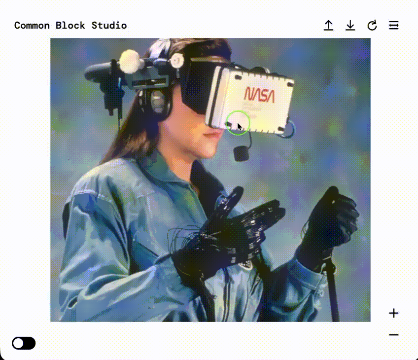

# 🎨 Blur Distortion Effect

> An interactive WebGL-style effect using **p5.js** where the cursor creates a blur/distortion trail across the screen.

---

## 🖼 Preview



---

## ⚙️ Getting Started

These instructions will get your project running locally.

```bash
# 1. Clone the repo
git clone https://github.com/suzubu/blur-distortion-effect.git

# 2. Navigate into the project folder
cd blur-distortion-effect

# 3. Install dependencies
npm install

# 4. Run the app
npm run dev
```

> Built with:  
> - [p5.js](https://p5js.org/)  
> - [Vite](https://vitejs.dev/)  

---

## ✨ Features

- 🎨 Mouse-driven blur/distortion brush  
- 🔄 Smooth fading trail effect  
- ⚡ Powered by lightweight p5.js rendering  
- 🛠 Easy to extend with new brushes and distortions  

---

## 💡 Dev Notes

- Developed as an experiment in real-time interactive distortion effects  
- Uses framebuffers and blending techniques for smooth trails  
- Designed for clarity and modularity for future shader-based expansion  

---

## 📚 Inspiration / Credits

This project was inspired by:

- SchultzSchultz ['https://schultzschultz.com/tools/']  

---

## 🧪 Known Issues

- ❌ Trails sometimes misalign on different screen sizes  
- 🔍 Performance may drop on lower-end GPUs  

---

## 🔭 Roadmap / TODO

- [ ] Update brush and cursor behvavior for smooth transition from canvas
- [ ] Optimize trail blending for smoother performance  
- [ ] Add UI controls for brush size and intensity  

---


## 📜 License

MIT — feel free to use and adapt!

---

## 🙋‍♀️ Author

Made with ☕ + 🎧 by [suzubu](https://github.com/suzubu)  
